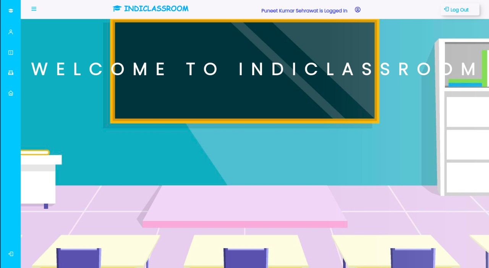

# IndiClassroom
#### Indian Education System Oriented Website

## Table Of Contents
  - [About](#about)
  - [Report](#report)

## Report
- [Click Here to View Report](https://docs.google.com/document/d/1FMofHCy3zmZOZAafZGWvm-TqdGNoneafIhKYe05Rtvo/edit?usp=sharing)

## About

We have made a Website that will be similar to Google classroom but more oriented to the Indian System of classes where a student studies a particular set of subjects based on the Stream or Course student chooses. It will allow multiple teachers and students to join a Classroom and remain updated about what is happening in every subject of that course.
This provides Transparency to the Teacher and which is currently a huge problem for teachers and students as well. Apart from this, we have also Implemented A facial Recognition System for taking Attendance to keep the problem of fake attendance in check.

The Website has following functionalities :

- Submit Assignment: Students can submit assignments assigned by teachers, if they submit it is marked as late submission, or if they don’t submit then it will be shown in the missing section.
- Attendance: Teachers will assign attendance for students and students can mark them using a facial recognition system. In this way, no other students can mark the false attendance of other students.
- Transparency: Teachers can see what assignments have been assigned by other teachers also when other teachers assign attendance they can see that particular course class is going on. 
- Assign and Create: The teacher can create subjects, assign attendance and assignment in the classroom. The teacher will be able to create a classroom and students can join the classroom using classroom code.

## Images

**Home Page**

## Contributors

[Puneet Kumar Sehrawat](https://github.com/seneark)

[Rajat Kumar](https://github.com/Rajat10Kumar)
